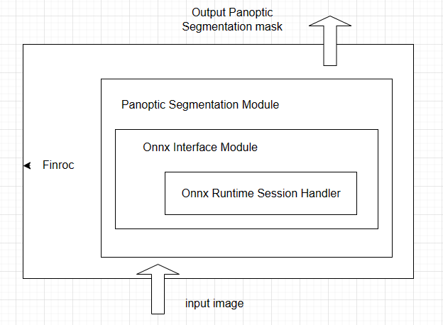

# Optimizing Panoptic Segmentation for Autonomous Vehicles in Pedestrian Zones
## Overview

Autonomous vehicles in pedestrian zones require a robust understanding of the scene for safe and efficient navigation. Panoptic segmentation, an integrated framework combining semantic segmentation (assigning a class label to each pixel) and instance segmentation (detecting and segmenting individual objects), emerges as an ideal solution for scene understanding. It assigns semantic labels ('stuff') and delineates individual instances ('things'), providing a comprehensive understanding of the scene. 

This thesis work focuses on optimizing existing Panoptic segmentation models for pedestrian zones and checking the feasibility of deploying the panoptic segmentation models on autonomous vehicles in pedestrian zones. This repository contains the implementation of optimizing panoptic segmentation for autonomous vehicles in pedestrian zones. The project employs the panoptic-deep lab method, a bottom-up panoptic segmentation approach, and focuses on further optimizing its performance in specific areas, such as pedestrian zones, and checking the feasibility of deploying this module on edge devices. Key aspects of the work include:

- Exploration of panoptic segmentation models with the right balance between performance and speed.
- Feasibility study for deploying the model on edge devices.
- Optimization of runtime inference speed by exporting the model to ONNX.
- Model size reduction and improved inference speed optimizations.
- Runtime inference using the ONNX runtime.
- Integrating the model into FINROC(robot operating system) for autonomous vehicle applications

## Folder Structure

- **FINROC (ROS):**
  - Contains C++ scripts for the panoptic segmentation module that loads the optimized ONNX model and performs inference.
  - Subscribes to incoming image data and publishes the panoptic segmentation output.
  - Includes a data extraction module for playback and extracting images from data recording `.bin` files, similar to ROS bag files.

- **infernce_scripts:**
  - Contains panoptic deep lab inference scripts.

- **ONNX:**
  - Contains scripts related to exporting the model to ONNX, optimization, and ONNX runtime inference scripts.

- **panoptic_seg_data_preparations:**
  - Scripts for preparing the data in COCO-panoptic segmentation format.

- **train:**
  - Contains training scripts and custom hook files.

## Usage

### 1. Setting up the Environment:

#### 1.1 Clone Detectron2 Repository and Install Dependencies:

Initially, clone the Detectron2 repository and install the required dependencies by following these steps:

git clone https://github.com/facebookresearch/detectron2.git

### 2. Using the FINROC(ROS) module : 
To utilize the panoptic segmentation module within the FINROC module, Install FINROC Environment. Ensure that you have FINROC installed and set up. Please refer to the official FINROC documentation git clone https://github.com/finroc/finroc_conventional.git

The Panoptic Segmentation FINROC module has an interface to the ONNX runtime, which loads the model. The panoptic segmentation module subscribes to a topic that publishes input images and subsequently publishes the panoptic segmentation output

This project is licensed under the [LICENSE NAME] - see the [LICENSE.md](LICENSE.md) file for details.

## Contact

For any questions or concerns, please feel free to contact [Your Name] at [your email].
